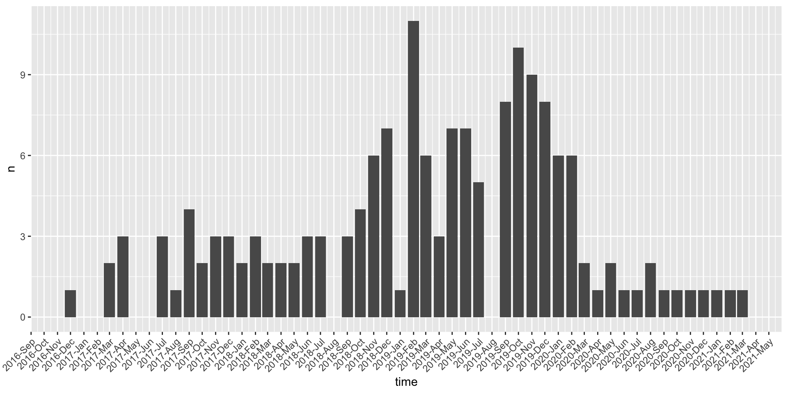

Our chapters have cancelled in-person meetups due to the corona virus pandemic. However, we want our members to be able to stay connected and still share their latest R-related discoveries and journeys. To support our chapter organisers in moving their events online, we decided to provide them with video conferencing infrastructure.

Our network has grown to over 160 chapters worldwide so we were wondering how many meeting rooms we would need. Was one enough or would that mean we'd have a lot of scheduling conflicts? What a nice opportunity to make use of our [{meetupr}](https://github.com/rladies/meetupr) package and get a sense of how often we've had overlapping events in the past!


### Get the data


```r
#devtools::install_github("rladies/meetupr")
library(meetupr)
library(tidyverse)
library(lubridate)
library(scales)
```

First, we get all the R-Ladies meetup groups so that we can get all their events in a second step.


```r
# get the R-Ladies chapters

groups <- meetupr::find_groups(text = "r-ladies") 

chapters <- groups %>% 
  filter(str_detect(tolower(name), "r-ladies"))
```


We want to avoid to exceed the API request limit so we'll use the [solution](https://github.com/rladies/meetupr/issues/30) posted by Jesse Mostipak.


```r
# get the events for the chapters

slowly <- function(f, delay = 0.5) {
  function(...) {
    Sys.sleep(delay)
    f(...)
  }
}

events <- map(chapters$urlname,
              slowly(safely(meetupr::get_events)),
              event_status = c("past", "upcoming")) %>% 
  set_names(chapters$name)
```

The use of `safely()` means that our mapping doesn't fail altogether if getting the events for any of the chapters fails. Now we just need to extract the events for those chapters where we succeeded.


```r
all_events <- map_dfr(events, 
                      ~ if (is.null(.$error)) .$result else NULL, 
                      .id = "chapter")
```


### How often (per month) do 2 or more R-Ladies meetup events happen at the same time?

First thing we want to know is whether two or more events happening at the same time was common or not?

To keep things simple, we are looking at events that start at the same time and are not looking at overlapping events for the time being. This includes past and upcoming events.


```r
all_events %>% 
  count(time) %>% 
  filter(n > 1) %>% 
  mutate(time = floor_date(time, unit = "months")) %>% 
  count(time) %>% 
  ggplot() + 
  geom_col(aes(time, n)) +
  scale_x_datetime(breaks = scales::date_breaks("1 month"),
                   labels = scales::date_format("%Y-%b")) +
  theme(axis.text.x = element_text(angle = 45, hjust = 1)) 
```

<!-- -->

So parallel R-Ladies events are not uncommon but now the question is: how many events are happening at the same time?


### How many events typically happen at the same time?


```r
all_events %>% 
  count(time, name = "simultaneous_events") %>% 
  count(simultaneous_events) %>% 
  arrange(desc(simultaneous_events))
```

```
## # A tibble: 5 x 2
##   simultaneous_events     n
##                 <int> <int>
## 1                   9     1
## 2                   4     1
## 3                   3    16
## 4                   2   144
## 5                   1  1953
```

One time we had 9 R-Ladies events happening at the same time! Looking at the date reveals that those were the rstudio::conf watch parties (Jan 29, 2020):


```r
all_events %>% 
  count(time, sort = TRUE) %>% 
  top_n(1) 
```

```
## Selecting by n
```

```
## # A tibble: 1 x 2
##   time                    n
##   <dttm>              <int>
## 1 2020-01-29 16:00:00     9
```

More than 2 parallel events have been relatively rare so we are starting with one virtual meeting room that our chapters can book and hope that scheduling conflicts can be avoided. 

If you are an R-Ladies organiser and want to use this new infrastructure, please join the #online_meetups channel on the organisers' Slack. There you'll find instructions on how to book a meeting and tips for running safe online events.


### Next online events

If you'd like to join events of R-Ladies chapters from around the world, the next events are

* April 25 R-Ladies Mumbai: [[ONLINE] - Exploring the 'Highcharts' visual in R](https://www.meetup.com/rladies-mumbai/events/270006904/)
* April 25 R-Ladies Tampa: [RESCHEDULED: Data Workflow and Transformation ](https://www.meetup.com/rladies-tampa/events/270192107/)
* April 25 R-Ladies La Paz: [Study Group - R para Ciencia de Datos [Sesión 4]](https://www.meetup.com/rladies-la-paz/events/270212766/)
* April 28 R-Ladies Bucharest: [R-Ladies Bucharest Community #8 ](https://www.meetup.com/rladies-bucharest/events/270178279/)
* April 28 R-Ladies Gainesville: [Tidy Tuesday: Practicing Data Science in R](https://www.meetup.com/rladies-gainesville/events/268773535/)
* April 28 R-Ladies Mid-Mo: [Code-RLadies April Lightning Talk & Workshop - Virtual!](https://www.meetup.com/rladies-mid-mo/events/268698590/)
* April 29 R-Ladies New York: [[Online event] R-Ladies Panel: All About Blogs](https://www.meetup.com/rladies-newyork/events/270210924/)
* April 30 R-Ladies Miami: [From Underdogs to Winners](https://www.meetup.com/rladies-miami/events/270087598/)
* May 05 R-Ladies Freiburg: [Tidy Tuesday - Tips and Tricks](https://www.meetup.com/rladies-freiburg/events/270214676/)
* May 06 R-Ladies Chicago: [Learning & Community Building in Data Science: Conference Talks!](https://www.meetup.com/rladies-chicago/events/269909895/)


**All R-Ladies meetup events are also listed at <https://www.meetup.com/pro/rladies/>.**
